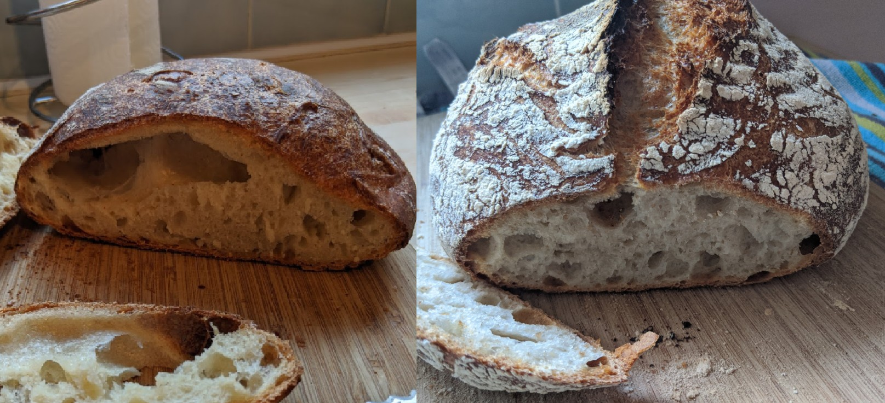

**EDIT: A few weeks later, I realise I'm one more amateur who caught a wave of quarantine-sourdough-making here. I'm still baking this recipe daily, but there are [much simpler recipes](https://cooking.nytimes.com/recipes/1018028-sourdough-no-knead-bread) for anyone who wants something really easy and [much more complex recipes](https://www.youtube.com/watch?v=85o0tVqaP1E) for anyone who wants something really spectacular.**

# Quarantine Bread
Bread is a good quarantine recipe. The ingredients are cheaper[^calories], denser and have a longer shelf-life than the final product, and the process of turning one into the other requires much more time than effort.

This recipe will take 16 hours of waiting, and about 15 mins of activity[^first]. It has four ingredients, requires nothing fancier than a dutch oven, and is surprisingly hard to mess up. Below are the first[^baked] and tenth loaves I've ever baked, both with this recipe:

The first was good; the tenth was great. Don't ask me what changed other than 'practice'; I didn't keep good enough notes.

## Ingredients
* Plain flour, 330g
* Salt, 6g
* Instant yeast, 1/12th teaspoon[^twelfth]
* 260g of lukewarm[^lukewarm] water

## Equipment
* Dutch oven[^dutch]
* Oven gloves
* Mixing bowl
* Kitchen bowl[^bowl]
* Plastic bag
* Kitchen scales
* Thermometer (optional)

## Schedule
There are many steps, but they are all very short. If you mess something up, don't worry, just carry on with the recipe. It'll probably be fine.

### The Night Before

* **7:00pm**:
  * Put the flour and water in the mixing bowl. 
  * [Mix with your hand](https://youtu.be/C4tgEQw4ibs?t=184).
  * Put the bowl in the bag to keep the dough moist.
* **7:30pm**:
  * Sprinkle the salt and yeast on top. 
  * [Pincer and fold it in with your hand](https://youtu.be/HoY7CPw0E1s?t=96). 
  * Put the bowl back in the bag.
* **8:00pm**: 
  * [Fold the dough](https://youtu.be/CQHuWDEo3SA?t=76). 
  * Put the bowl back in the bag.
* **8:30pm**: 
  * [Fold the dough](https://youtu.be/CQHuWDEo3SA?t=76). 
  * Put the bowl back in the bag and leave overnight.

### The Morning Of

* **8:00am**: 
  * Dampen the inside of the kitchen bowl, then cover the bowl in a layer of flour.
    * The water's to help the flour stick to the vertical bits of the bowl; the flour's to stop the dough from sticking to the bowl.  
  * [Shape the loaf](https://youtu.be/MPdedk9gJLQ?t=119). 
  * Put the shaped loaf in the floured kitchen bowl. 
  * Flour the top of the shaped loaf.
    * The top of the dough now will be the bottom of the loaf. Lots of flour will stop it sticking to the dutch oven.
  * Put the bowl in the bag.
* **8:30am**:
  * Set the oven to 250C/Gas Mark 9ish, or as close as you can get. 
  * Put the dutch oven in the oven to preheat.
* **9:15am**: 
  * With *OVEN GLOVES* take the dutch oven out and take the lid off. 
  * Rest the *OVEN GLOVES* on the dutch oven and lid so you don't try to pick them up with bare hands. 
  * [Turn out the dough onto a floured surface](https://youtu.be/rtoMhY0vS9E?t=132).
    * If it sticks, just get your hand in there and scrape it out while breaking as few 'strands' as possible. Don't panic if you do, it'll turn out fine.
  * *CAREFULLY* put the dough in the dutch oven. 
  * With *OVEN GLOVES*, put the lid back on, then put the dutch oven in the oven.
* **9:45am**: 
  * With *OVEN GLOVES*, take the lid off the dutch oven. This is to let the crust brown.
  * Rest the *OVEN GLOVES* on the removed lid so you don't try to pick it up. 
* **10:00am**: 
  * Check the colour of crust; if it's dark enough for you, use *OVEN GLOVES* to take the loaf out now. 
* **10:15am**: 
  * Check the colour of the crust; if it's dark enough for you, use *OVEN GLOVES* take the loaf out now. 
  * Upend the dutch oven onto the worksurface and hope the loaf falls out.
    * If it doesn't, leave the loaf to steam itself upside-down for a while, then try and lever it out with a spatula or something.
    *  Use more flour on the bottom in future.
  * Rest the loaf at a 45' angle against something so it can cool from all directions.
* **10:45am**: 
  * The loaf is now cool. 
    * Cut it sooner than this and some of the moisture will escape as steam.
  * Cut a slice.
  * Cover it in butter.
  * Eat. 

The *OVEN GLOVES* are emphasised because you _will_ accidentally reach for something screaming hot, and even glancing contact with 250C metal makes for a bad burn.

## Notes

The recipe is a 500g version of Ken Forkish's Overnight White Loaf. [His book has details, explanations, and a load more recipes](https://smile.amazon.co.uk/Flour-Water-Salt-Yeast-Fundamentals/dp/160774273X). 

There are many bread recipes on the internet, and many variations of this particular recipe[^hn]. If you've not baked bread before, try not to get paralysed choosing between recipes or choosing between equipment. Use what you have, pick a recipe - any recipe - and just try it out. The uplift in quality you'll get from a trial run is much greater than the uplift from having picked the exact right recipe.

If you are the kind of person who really likes to do their research first though, the places to start are Forkish's book and [/r/breadit](https://www.reddit.com/r/Breadit).

I wrote this recipe out _despite_ there being a thousand other equivalent recipes out there because I was annoyed by the the amount of cruft folded into most recipe descriptions. A bullet-pointed schedule, on a minimalist website, with links to technique videos, well, I felt it'd appeal to people who wouldn't usually bake.

[^calories]: If you fancy living 13th-century style, 2000kcal of home-made bread is 35p of flour, salt and yeast.
[^first]: Maybe not 15 mins your first time round.
[^baked]: And that was a few weeks ago.
[^twelfth]: A third of a quarter-teaspoon. It's too small to measure with a normal gram-accurate scale.
[^lukewarm]: 34C if you've got a a thermometer, but a few degrees of drift won't change much. Main limit is 40C, beyond which the yeast will die.
[^dutch]: Honestly any oven-safe metal or ceramic dish with a lid will do. 
[^bowl]: Ideally 15cm-ish across. It doesn't matter much.
[^hn]: [HackerNews](https://news.ycombinator.com/item?id=22625590) has some suggestions.
