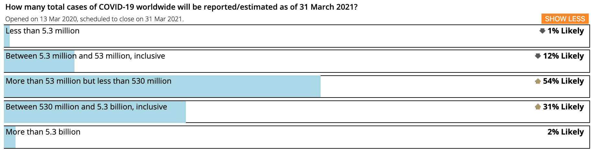
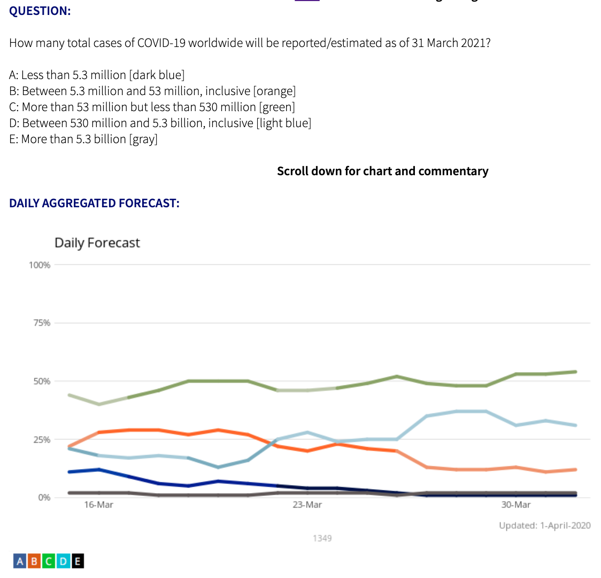

**EDIT: Months later, I'm still reasonably happy with this, but I've also come to think it's a lot of words and anger for a simple idea: talk about your models.**

## Headlines about coronavirus case counts are worthless

I have a crystal ball.

I can tell you what tomorrow's case number is going to be almost perfectly: it's today's case number, times whatever the average growth rate has been the past week. Applied over all the countries in the world with lots of cases, this scheme manages a 99.91% correlation[^ridiculous].

That is to say: whatever the case number you see in the newspaper is, you could predict it almost perfectly with information you had already. _Daily case count headlines add nothing_. After you've read the first few, reading any more tells you nothing new.

So if there's no point in you reading about case counts, what should you read about instead?

## Predictions

Taking my dumb average-over-the-past week model and applying it to the US today, then by the 13th of May there should be more cases than there are people in the US.

_That_ should be the lede: that this guy's predictions say that in forty days time, there will be more cases than people in the US. That's ridiculous! What's wrong with this guy's approach? What's wrong with this guy, he's clearly never done any epidemiology in his life![^epidemiologists] We should really be paying attention to these other predictions: A, B, C.

I would be ecstatic with that lede. I badly want a loud, angry row about models and modelling assumptions, because that's the only way to peer into the future and get ahead of this thing. But I have not seen anything like that, anywhere[^journalism].

Until the day we get such a big public discussion, I would strongly suggest following the [the Good Judgement Project's dashboard](https://goodjudgment.io/covid/dashboard/) as the product of a _private_ discussion about models and modelling assumptions[^quality]:

Their models suggest there'll be somewhere going on 250 million cases of coronavirus by this time next year.

250 million cases.

**EDIT**: Originally I picked a billion as the average of the above distribution. Two days afterwards I actually went and took a geometric average and decided 250 million is more reasonable. The mathematician in me says '250m vs 1bn is much of a muchness on a distribution like that', but the pragmatist says I really should've done the maths first _then_ wrote this post.

Now if you've been looking at the news, that might shake you to your bone. But if you came back tomorrow it'd no longer be informative, it'd be no longer worth reading. What's informative, what's the thing you should read daily, is the trend, which you can see via the 'Show More' button on the dashboard:

The trend has been _stable and increasing since mid-March_. The best forecasters in the world were _fairly_ confident there'd be hundreds of millions of cases three weeks ago, and they're getting ever more confident.

Left to headlines, you'd find that out yourself sometime next year.

[^ridiculous]: Case numbers are strongly correlated and heteroskedastic and most people only care about their own country's counts, so quoting a straight correlation here is _technically_ okay but _really_ disingenuous. Heck, using the previous day's figure directly gets you 99.6% corr! If I were to predict change-in-log-cases - which has a far nicer distribution - with the same formula gets me 66% corr, 75% if I chuck outliers. [Code's here](https://colab.research.google.com/drive/1J0TnyfgCLueN_ee-1A_h8rN8XM7U-S2a).

[^epidemiologists]: There is a substantial backlash against non-epidemiologists doing epidemiology at the moment. I think it's deserved, but also that _non-epidemiologists should carry on doing epidemiology_. There are not many epidemiologists in the world, but there is an awful lot of epidemiology to be done. This means there is a balance to be struck between the downsides of work being done badly, and the downsides to work not being done at all. Ideally volunteers would be rolled into [an experienced-epidemiologist-lead program](https://royalsociety.org/news/2020/03/Urgent-call-epidemic-modelling/), but if one of those hasn't shown up in your country yet then I think the balance is best struck by doing the work but doing it humbly.

[^journalism]: There is a debate to be had about whether journalism is capable of supporting this kind of analysis, and there is a debate to be had about whether society is capable of supporting journalism that is capable of supporting this kind of analysis. I have many opinions on this and none I'm confident of.

[^quality]: I think highly of the Good Judgement Project because it's tried harder to validate it's methodology than anyone else. [AI Impacts has an excellent summary of their work here](https://aiimpacts.org/evidence-on-good-forecasting-practices-from-the-good-judgment-project-an-accompanying-blog-post/).