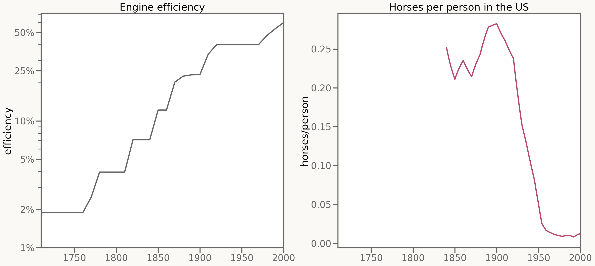
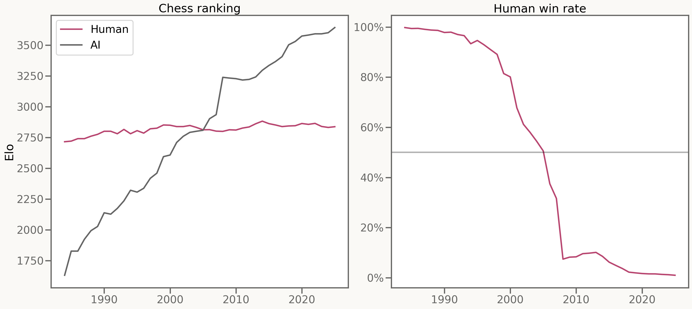
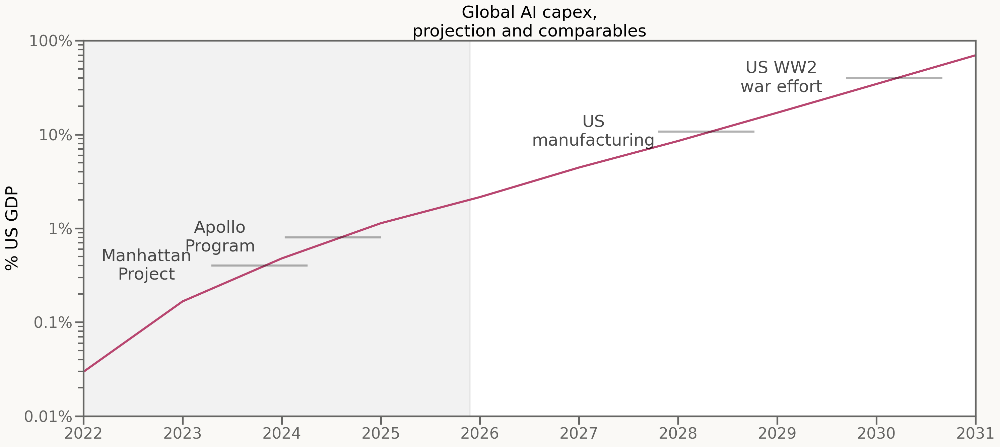
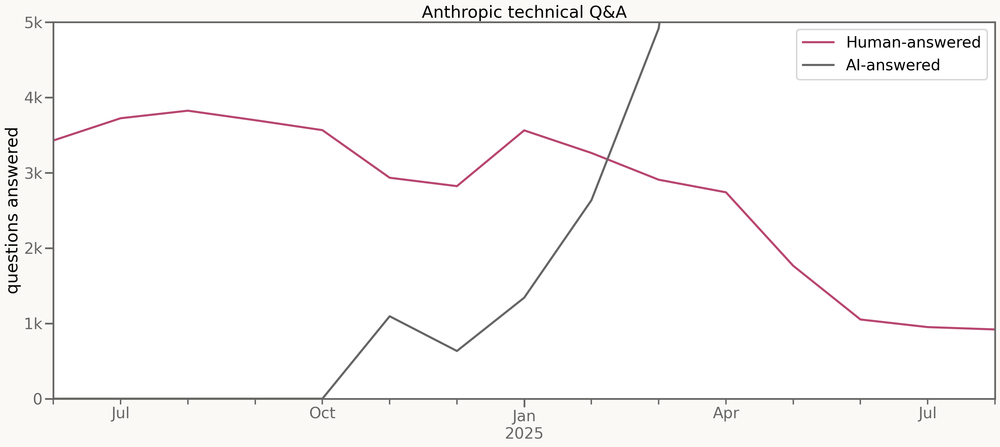
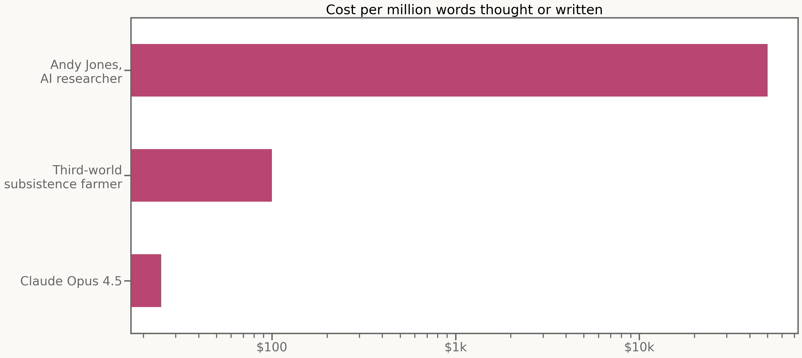
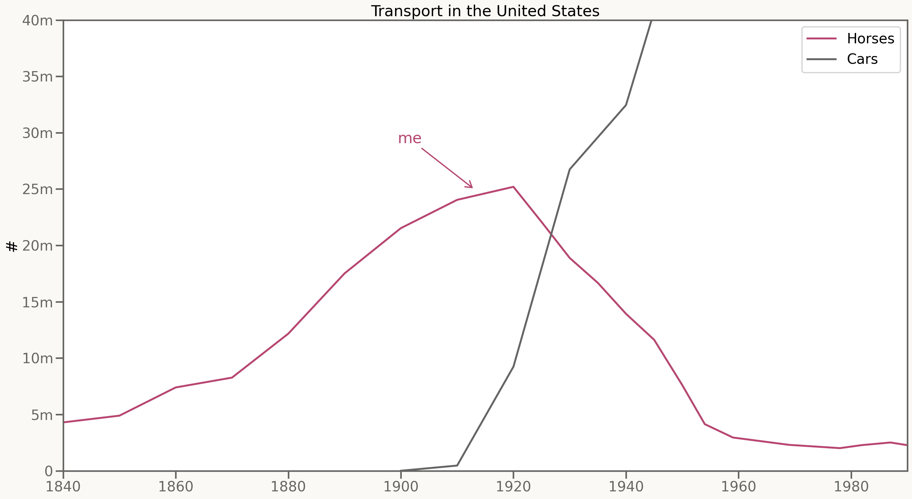

# Horses

So after all these hours talking about AI, in these last five minutes I am going to talk about: horses.

Engines, steam engines, were invented in 1700.

And what followed was 200 years of steady improvement, with engines getting 20% better a decade.

For the first 120 years of that steady improvement, horses didn't notice at all.

Then, between 1930 and 1950, 90% of the horses in the US disappeared.

Progress in engines was steady. Equivalence to horses was sudden.

But enough about horses. Let's talk about chess!

Folks started tracking computer chess in 1985.

And for the next 40 years, computer chess would improve by 50 Elo per year.

That meant in 2000, a human grandmaster could expect to win 90% of their games against a computer.

But ten years later, the same human grandmaster would lose 90% of their games against a computer.

Progress in chess was steady. Equivalence to humans was sudden.

Enough about chess! Let's talk about AI.

Capital expenditure on AI has been pretty steady.

Right now we're - globally - spending the equivalent of 2% of US GDP on AI datacenters each year.

That number seems to have steadily been doubling over the past few years.

And it seems - according to the deals signed - likely to carry on doubling for the next few years.

But from my perspective, from equivalence to me, it hasn't been steady at all.

I was one of the first researchers hired at Anthropic.

This pink line, back in 2024, was a large part of my job. Answer technical questions for new hires.

Back then, me and other old-timers were answering about 4,000 new-hire questions a month.

Then in December, Claude finally got good enough to answer some of those questions for us.

In December, it was some of those questions. Six months later, 80% of the questions I'd been being asked had disappeared.

Claude, meanwhile, was now answering 30,000 questions a month; eight times as many questions as me & mine ever did.

Now. Answering those questions was only part of my job.

But while it took horses decades to be overcome, and chess masters years, it took me all of six months to be surpassed.

Surpassed by a system that costs one thousand times less than I do.

A system that costs less, per word thought or written, than it'd cost to hire the cheapest human labor on the face of the planet.

And so I find myself thinking a lot about horses, nowadays.

In 1920, there were 25 million horses in the United States, 25 million horses totally ambivalent to two hundred years of progress in mechanical engines.

And not very long after, 93 per cent of those horses had disappeared.

I very much hope we'll get the two decades that horses did.

But looking at how fast Claude is automating my job, I think we're getting a lot less.

*This was a five-minute lightning talk given over the summer of 2025 to round out a small workshop.*

*All opinions are my own and not those of my employer.*