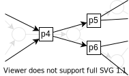

<script src="https://polyfill.io/v3/polyfill.min.js?features=es6"></script>
<script id="MathJax-script" async src="https://cdn.jsdelivr.net/npm/mathjax@3/es5/tex-mml-chtml.js"></script>
<script>window.MathJax = {
  tex: {
    inlineMath: [['$', '$'], ['\\(', '\\)']]
  }
};</script>

# A Clearer Proof of the Policy Gradient Theorem

The policy gradient theorem is a foundational result in reinforcement learning. It turns the derivative of the total reward (hard!) into the derivative of the policy (easy!). Unfortunately, the usual proof uses more algebraic manipulation than you'd like in a foundational result.

Instead, this proof starts with an unusual view of reinforcement learning problems, a view from which you only need a small amount of maths to get to the theorem.

## The View

A common way to think about reinforcement learning is that each timestep you find yourself sitting in a state, visualized as a node in a graph. You choose an action - an edge - out of the current state, and the environment takes you from that edge into a new node for the next timestep.


This two-stage transition - node to edge and edge to node - is tricky to work with. It'd be much better if there were only one stage, but you can't ignore the edges entirely because there's valuable information - like rewards - that are defined by which action you take. 

What you can do instead is replace each edge with it's own node, representing a *state-action pair*:



Now each timestep has one stage: you're in a node, corresponding to a state-action, and between you and the environment you - somehow - choose a new node for the next timestep. This muddies the boundary between agent's behaviour and environment's behaviour, but for our purposes of proving the policy gradient theorem that's not a problem.

## The Notation

In this way of thinking, you can stack the probability of finding yourself in each state-action to get a *position vector* $p$. This means that $p_i$ is the probability of being in state-action $i$.

Then to go from one position vector to the next, you simply multiply your current position vector by the transition matrix:
$$
p^\prime = p \Pi
$$ 

In this matrix, element $\Pi_{ij}$ gives the probability of going from state-action $i$ to state-action $j$. $\Pi$ merges the behaviour of the environment with the behaviour of the agent, but again that's fine because the policy gradient theorem doesn't distinguish one from the other. 

Since transitioning is now simple as multiplication, if you start in a position distribution $p_0$ then your position after $k$ steps has a nice form:
$$
p^{(k)} = p_0 \Pi^k
$$

More, if $r$ is a column vector of rewards for each state-action then the reward earned in the $k$th step has a similarly nice form:
$$
r^{(k)} = p^{(k)} \cdot r
$$

With this notation in hand, the total reward earned by a policy can be written as 
$$
J = \sum r^{(k)} = \sum p_0 \Pi^k r
$$

This formula for the total reward can be parsed two ways. The first way is in terms of the *state-action frequency* $d$:
$$
d = \sum p_0 \Pi^k  \quad\implies\quad J = d \cdot r
$$

This says the total reward is how often you end up in each state-action, multiplied by the reward you get from being there.

The second way to parse the total reward is in terms of the *state-action value* $q$:
$$
q = \sum \Pi^k r \quad\implies\quad J = p_0 \cdot q
$$ 

This says the total reward is simply the value of the initial state.  

To recap, 
  * $p_0$ is a row vector giving the initial state-action distribution.
  *  $r$ is a column vector of the rewards for each state-action.
  * $\Pi$ is the transition matrix, which gives the probability of going from one state-action to another under the policy.
  * $d$ is a row vector of the frequencies of visiting each state-action under the policy.
  * $q$ is a column vector giving the values - the total future reward - of each state-action under the policy.
  * $J$ is the total reward earned by the policy.


## The Simple Proof
The simple way to finish the proof is to act like all the matrices are actually real numbers. Then you can use [the geometric formula](https://en.wikipedia.org/wiki/Geometric_series#Formula) to write $\sum \Pi^k = \frac{I}{I-\Pi}$ , so that
$$
d = \frac{p_0}{I - \Pi} \qquad J = p_0 \frac{I}{I - \Pi} r \qquad q = \frac{r}{I - \Pi}
$$

This matrix $\frac{I}{I - \Pi}$ has a simple interpretation: element $ij$ is the number of times you'll visit state-action $j$ if you start in state-action $i$.  

Once you've got these three definitions, you can use high-school calculus to work out that the gradient of the total reward is
$$
J^\prime = p_0 \left( \frac{I}{I - \Pi} \right)^\prime r = p_0 \frac{\Pi^\prime}{(I - \Pi)^2}r = d \Pi^\prime q
$$

That's the policy gradient theorem: $J^\prime = d \Pi^\prime q$. The left-hand side is hard, the right-hand side is easy. QED. 

Kinda.

This approach 'works' in that it gives the right answer using rules you're familiar with, but it involves more than one illegal operation. For one, $I - \Pi$ can't be inverted. To do things properly requires a bit more indirection.

## The Correct Proof
Although $q$ and $d$ are easiest to intuit as sums, multiplying their definitions through by $\Pi$ gives a neat defining identity for each one:
$$
\begin{aligned}
d = d \Pi + p_0 \qquad q = \Pi q + r
\end{aligned}
$$

or - gathering the terms - 
$$
\begin{aligned}
p_0 = d(I - \Pi) \qquad r = (I - \Pi)q
\end{aligned}
$$

They can also be turned into neat identities for the gradient:
$$
d^\prime (I - \Pi) = d \Pi^\prime \qquad (I - \Pi) q^\prime = \Pi^\prime q
$$

Given these identities, the policy gradient theorem falls out in two symmetric ways. The gradient of the total reward is 
$$
J^\prime = d^\prime \cdot r = d^\prime (I - \Pi) q = d \Pi^\prime q \quad\quad J^\prime = p_0 \cdot q^\prime = d (I - \Pi) q^\prime = d \Pi^\prime q
$$

Once more, $J^\prime = d \Pi^\prime q$. QED.

## Notes
An especially nice thing about this notation is that $J^\prime = d \Pi^\prime q$ has an obvious interpretation. $J^\prime$ will be positive when $\Pi^\prime$ increases the likelihood of transitions that go from oft-visited state-actions to high-value state-actions. Just the behaviour you want!  

You can find the usual proof of the policy-gradient theorem on §13.2/p269 of [Sutton & Barto](http://incompleteideas.net/book/bookdraft2017nov5.pdf). The usual proof is more compact, but requires an infinite telescope of the gradient that confuses things. You can find a version with more commentary [here](https://lilianweng.github.io/lil-log/2018/04/08/policy-gradient-algorithms.html#proof-of-policy-gradient-theorem), or an alternative approach based on expectations [here](https://spinningup.openai.com/en/latest/spinningup/rl_intro3.html#deriving-the-simplest-policy-gradient).

Thanks to [Adam Gleave](https://gleave.me/) and [Jacob Hilton](https://www.jacobh.co.uk/) for comments and suggestions, and to [Jerry Lin](https://github.com/jerry73204) for corrections.

## Citation
```
@article{jones2020CPPGT,
  title   = "A Clearer Proof of the Policy Gradient Theorem",
  author  = "Andy L. Jones",
  journal = "andyljones.com",
  year    = "2020",
  url     = "https://andyljones.com/posts/policy-gradient.html"
}
```