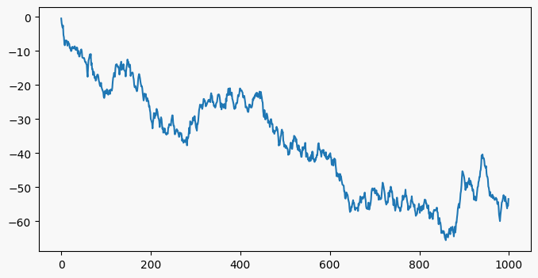

# Post-Mortem Python Plotting

Next time you're in your Jupyter notebook and you get an error somewhere deep in your stack, run `%debug`. It's a *post-mortem debugger*, and it'll [drop you in an interpreter right where the error happened](https://docs.python.org/3/library/pdb.html). You can inspect all the variables, go up and down the stack, and figure out what happened.

That should be enough to rock the world of some readers, but there's more! The problem with pdb is it's a very limited interpreter, lacking such luxuries as tab completion. What about if the bug requires something more powerful? Well my friend, do I have a snippet for you:

```python
def extract():
    """Copies the caller's environment up to your Jupyter session"""
    import inspect
    import ctypes
    
    frames = inspect.stack()
    caller = frames[1].frame
    name, ls, gs = caller.f_code.co_name, caller.f_locals, caller.f_globals

    ipython = [f for f in inspect.stack() if f.filename.startswith('<ipython-input')][-1].frame
    
    ipython.f_locals.update({k: v for k, v in gs.items() if k[:2] != '__'})
    ipython.f_locals.update({k: v for k, v in ls.items() if k[:2] != '__'})
    
    ctypes.pythonapi.PyFrame_LocalsToFast(ctypes.py_object(ipython), ctypes.c_int(0))
```
`extract` is the single most useful function I've written in five years of working in Python. It grabs the caller's environment, finds your interpreter session in the stack, and [stuffs the caller's env into that session](http://pydev.blogspot.co.uk/2014/02/changing-locals-of-frame-frameflocals.html). Here it is working in isolation:

``` python
def f():
    x = 'hello world'
    extract()

>>> f() # copies f's internals into the session
>>> print(x) # prints 'hello world'
```
See? It's magic enough just by itself. But in combination with `%debug`, it's [more magic](http://catb.org/jargon/html/magic-story.html).

## A Daft Example
The killer feature is when you've got some piece of numerical analysis that fails _occasionally_. Debugging things that fail occassionally is misery since if you knew what circumstances caused the bug, you'd probably already have fixed it. Post-mortem debugging is a lifesaver in this case, since it lets you wait for the circumstances that cause the bug to turn up naturally.

Consider this snippet, 

```python
def random_walk():
    return np.random.normal(size=1000).cumsum()
    
def first_positives():
    idxs = []
    for _ in range(100):
        xs = random_walk()
        idxs.append((xs > 0).nonzero()[0][0])
    return np.array(idxs)
```

which generates the distribution of times at which a random walk becomes positive. Most of the time it runs fine, but occasionally it throws an `IndexError`!

What on earth? I call `%debug` and get the usual prompt

```
> <ipython-input-36-cd128c0c6b16>(12)first_positives()
     10     for _ in range(10):
     11         xs = random_walk()
---> 12         idxs.append((xs > 0).nonzero()[0][0])
     13     return np.array(idxs)
     14 

ipdb>
```
and type `p xs` to see if there's something obviously wrong. [It doesn't look like anything to me](https://thumbs.gfycat.com/DenseGleefulDutchshepherddog.webp): 

```
ipdb> p xs
array([ -0.44560791,  -1.79932944,  -2.56393172,  -3.10994348,
        -2.54914905,  -5.29201201,  -5.96402224,  -7.65870068,
        -8.34737223,  -7.12503207,  -6.90961605,  -6.87986835,
        -6.97889256,  -7.88125706,  -8.45506909,  -7.23593778,
```

Just a bunch of numbers. Hrm. Ok, in I type `extract()`, and quit the debugger. Back in my Jupyter session, `xs` has - magically! - appeared in my workspace, and a quick `plt.plot(xs)`



*...shows that sometimes the random walk never becomes positive.* D'oh. Never becomes positive means an empty array of positive indices, meaning `[0]` is out of bounds.

That's an artificial, facile, ridiculous example which - on purportedly less random data - happens to me three times a week. Once upon a time I'd have to commit actual thought to figuring out what scenario was leading to an out of bounds. With the help of `pdb` and `extract`, I can instead program thoughtlessly!

### Other tricks

* You can also invoke the post mortem debugger with `pdb.pm()` rather than going through the `%debug` magic.  

* You don't have to invoke `extract` from the base of the stack. You can go up a few levels first, if you think the error's cause is in a different place from where it's discovered. [Learning the debugger commands is absolutely worth it](https://docs.python.org/3/library/pdb.html#debugger-commands).

* You don't have to wait for an error either. You can drop `breakpoint()` - an alias for `import pdb; pdb.set_trace()` - in your code anywhere to get to the debugger, or you can simply call `extract` directly. 

* If I'm chasing some numerical issue, I'll often set up `if` statements that trigger `extract` when values get particularly large or small.

* I have `extract` and some other utilities bundled up in a personal tools package that I call [`aljpy`](https://github.com/andyljones/aljpy). When I find myself somewhere new, I install it using `pip install git+https://github.com/andyljones/aljpy.git` and then call extract with `import aljpy; aljpy.extract()`. I wouldn't recommend using my tools package since I'll change it on a whim, but I do recommend building your own.

* Incidentally, the code above is not version I use. I've also nailed on support for grabbing the locals of arbitrary functions and modules. It also throws an error on exit, which drops me directly back to my session where my new locals are waiting.

```python
def extract(source=None):
    """Copies the variables of the caller up to iPython. Useful for debugging.
    
    .. code-block:: python
    
        def f():
            x = 'hello world'
            extract()
        
        f() # raises an error
    
        print(x) # prints 'hello world'
        
    """
    import inspect
    import ctypes 
    
    if source is None:
        frames = inspect.stack()
        caller = frames[1].frame
        name, ls, gs = caller.f_code.co_name, caller.f_locals, caller.f_globals
    elif hasattr(source, '__func__'):
        func = source.__func__
        name, ls, gs = func.__qualname__, (func.__closure__ or {}), func.__globals__
    elif hasattr(source, '__init__'):
        func = source.__init__.__func__
        name, ls, gs = func.__qualname__, (func.__closure__ or {}), func.__globals__
    else:
        raise ValueError(f'Don\'t support source {source}')

    ipython = [f for f in inspect.stack() if f.filename.startswith('<ipython-input')][-1].frame
    
    ipython.f_locals.update({k: v for k, v in gs.items() if k[:2] != '__'})
    ipython.f_locals.update({k: v for k, v in ls.items() if k[:2] != '__'})
    
    # Magic call to make the updates to f_locals 'stick'.
    # More info: http://pydev.blogspot.co.uk/2014/02/changing-locals-of-frame-frameflocals.html
    ctypes.pythonapi.PyFrame_LocalsToFast(ctypes.py_object(ipython), ctypes.c_int(0))
    
    message = 'Copied {}\'s variables to {}'.format(name, ipython.f_code.co_name)
    raise RuntimeError(message)
```
